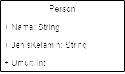
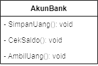
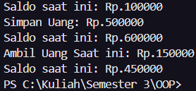

# Pertemuan 3

| Keterangan  | Data |
| --- |  --- |
| **Nama** | Eky Fikri Yamansyah |
| **NIM** | 312310572 |
| **Kelas** | TI.23.A6 |

## Latihan 1
**1.Apa yang harus didefinisikan sebelum membuat objek?**
* Sebelum membuat objek kita perlu mendefinisikan sebuah class terlebih dahulu yang nanti nya class berfungsi sebagai blueprint.

**2.Buatlah gambar diagram class dan dua buah objek dari class Person bernama Antor dan Riko**



**3.Buatlah gambar diagram objek AkunBank dengan instance method simpanUang, ambilUang dan cekSaldo**



## Latihan 2

**Buatlah kode program java untuk:**
* Mendeklarasikan class Person, dengan atribut Nama,JenisKelamin, Umur
* Buatlah dua buah objek dari class Person bernama Anton dan Riko
### Source Code
  ```java
  public class person {

    String nama;
    String jenisKelamin;
    int umur;

    public static void main(String[] args) {

        // instance class anton
        person anton = new person();

        // instance class riko
        person riko = new person();

        // atribut anton
        anton.nama = "Anton";
        anton.jenisKelamin = "Laki-Laki";
        anton.umur = 17;

        // atribut riko
        riko.nama = "Riko";
        riko.jenisKelamin = "Laki-Laki";
        riko.umur = 18;

        // output anton
        System.out.println("Nama : " + anton.nama);
        System.out.println("Jenis Kelamin : " + anton.jenisKelamin);
        System.out.println("Umur : " + anton.umur);

        // output riko
        System.out.println("Nama : " + riko.nama);
        System.out.println("Jenis Kelamin : " + riko.jenisKelamin);
        System.out.println("umur : " + riko.umur);

    }
  }
```
## Latihan 3
**Buatlah kode java untuk:**
* Mendeklarasikan class AkunBank dengan instance method simpanUang, ambilUang dan cekSaldo
* Buat objek AkunBank dan tetapkan nilai saldo awal Rp. 100000, kemudian panggil 3 method tersebut dan tampilkan proses

```java
public class AkunBank {
    // Atribut
    int uang;
    int depo;
    int tarik;

    public void SimpanUang() {
        if (depo >= 0) {
            uang += depo;
            System.out.println("Simpan Uang: Rp." + depo);
            System.out.println("Saldo saat ini: Rp." + uang);
        }
    }

    public void CekSaldo() {
        if (uang >= 0) {
            System.out.println("Saldo saat ini: Rp." + uang);
        } else {
            System.out.println("Saldo tidak cukup");
        }
    }

    public void AmbilUang() {
        if (uang >= 0) {
            uang -= tarik;
            System.out.println("Ambil Uang Saat ini: Rp." + tarik);
            System.out.println("Saldo saat ini: Rp." + uang);
        }
    }

    public static void main(String[] args) {
        // Instance Class Akun
        AkunBank akun = new AkunBank();
        
        // Nilai Atributes
        akun.uang = 100000;
        akun.tarik = 150000;
        akun.depo = 500000;

        // Method
        akun.CekSaldo();
        akun.SimpanUang();
        akun.AmbilUang(); //
    }
}
```
* Output


